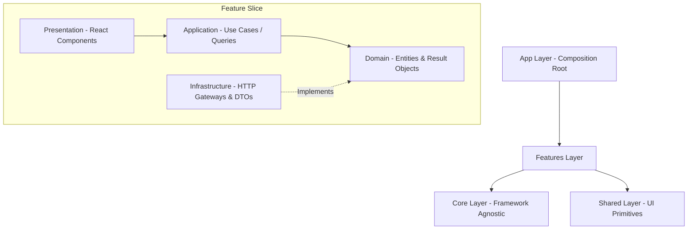

# Enterprise Library Management System (LibraryMS) - Frontend SPA

Welcome to the **Library Management System (LibraryMS) Frontend**. This project is a modern, enterprise-grade Single Page Application (SPA) built using **React 18**, **Vite**, and **TypeScript**. It rigorously follows **Clean Architecture** principles and **Domain-Driven Design (DDD)** on the frontend.

## 🚀 Technology Stack

- **Core**: React 18, TypeScript, Vite
- **State Management**: 
  - Server State: `@tanstack/react-query` (Caching, synchronization, and invalidation)
  - Client/UI State: `zustand` (Thin, atomic client state stores)
- **Styling & UI**: Tailwind CSS (via PostCSS), Radix UI Primitives (Accessible headless components), Lucide React (Icons), `motion/react` (Animations)
- **Forms & Validation**: `react-hook-form`, `zod` (Strict payload boundaries and form validations)
- **Routing**: Client-side routing with role-based protected guards.
- **Testing & Quality**: ESLint, Prettier, TypeScript strict mode (`npm run validate` enforcement).

---

## 🏛️ Frontend Clean Architecture

Unlike typical React apps where components hold all logic, this project enforces a strict boundary between UI and Business Logic using a frontend adaptation of **Hexagonal / Ports & Adapters Architecture**.

Dependencies always point inward: `app → features → shared → core`.



### Layer Breakdown
*   **Core (`@core`)**: Framework-agnostic foundation containing HTTP clients, Result/Either monads (`Result<T, Error>`), custom AppErrors, and Base Domain entities. Imports nothing else.
*   **Shared (`@shared`)**: Generic UI primitives (Buttons, Modals, Spinners), form utilities, and styling constants. Knows nothing about business features.
*   **Features (`@features/<name>`)**: Vertical business slices (Auth, Dashboard, Books, Members, etc.). Each feature contains its own:
    *   `presentation`: React components, Pages, and custom hooks.
    *   `application`: Use cases wrapping business logic.
    *   `domain`: Entities and Interfaces (Ports).
    *   `infrastructure`: HTTP Gateways (Adapters) and Zod DTO parsers. Anti-corruption layer.
*   **App (`@app`)**: The composition root. Wires concrete implementations, initializes the router, and provides global context. No Reflection or IoC containers; pure manual dependency injection.

---

## 🎭 Role-Based Experiences

The application dynamically adapts its UI and functionality based on the authenticated user's JWT Role Claims (`Admin`, `Librarian`, `Member`).

### 🛠️ 1. Administrator (Global Access)
*   Full view of the **System Dashboard** across all branches.
*   Manages **Branches** and assigns Librarians to specific branches.
*   System-wide configuration and global member oversight.

### 📚 2. Librarian (Branch-Level Access)
*   Branch-specific **Dashboard** (total members, active borrows, overdue metrics in their branch).
*   Manages the **Book Catalog** (Adding books, updating inventory copies).
*   Handles **Member Onboarding** and **Fines Collection** for their specific branch.
*   Processes physical **Borrows & Returns**.

### 👤 3. Member (Self-Service)
*   Personal **Member Dashboard** showcasing their Active Borrows, Outstanding Fines, Membership Expiry, and Nearest Due Dates.
*   Explores the public **Book Catalog** with dynamic search and branch availability filtering.
*   Manages **Reservations** for books currently out of stock.

---

## 🛑 Strict Error Handling (Railway Oriented Programming)

Exceptions (`throw new Error()`) are strictly banned for business logic. 
Instead, the application uses a **Result Monad** (`@core/result`) across all boundaries.

- **Gateways** catch HTTP errors and return a `Result<Data, AppError>`.
- **Use Cases** process the `Result` and pass it to the UI.
- **Components** gracefully handle the `Result.error` via Toast notifications or inline error messages, ensuring the app never crashes from unhandled promise rejections.

---

## 🛠️ Development Setup & Commands

### Prerequisites
- Node.js (v20+ recommended)
- `npm` (v10+)

### Installation
1. Clone the repository:
   ```bash
   git clone <repository-url>
   cd LibraryMS-UI
   ```
2. Install dependencies:
   ```bash
   npm install
   ```

### Environment Configuration
1. Copy the example environment file:
   ```bash
   cp .env.example .env.local
   ```
2. Set the backend API URL inside `.env.local`:
   ```env
   VITE_API_BASE_URL=https://localhost:44353
   ```

### Scripts

*   `npm run dev` — Start the Vite dev server at http://localhost:5173.
*   `npm run build` — Compile TypeScript and build the production bundle into the `dist/` folder.
*   `npm run validate` — **The Gatekeeper**. Runs Typecheck + Linting. This must pass with **0 warnings** before committing any code.
*   `npm run typecheck` — Runs TypeScript compiler checks without emitting files.
*   `npm run lint` — Runs ESLint.

---

## 🐳 Docker Support

The project is fully containerized for production deployment.

- **Build Image:** Uses a lightweight `node:20-alpine` image to install dependencies and build the static assets.
- **Runtime:** Serves the assets via an ultra-fast `nginx:1.27-alpine` web server configured for SPA fallback routing (handling 404s by serving `index.html`) and aggressive static caching.

To run the frontend locally via Docker (make sure to set the correct backend URL if needed):
```bash
docker build -t libraryms-ui .
docker run -d -p 5173:80 --name libraryms-ui-app libraryms-ui
```
The app will then be available at `http://localhost:5173`.
